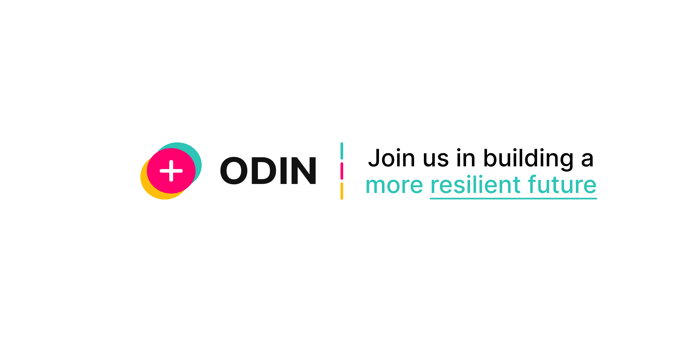

<p align="center">

</p>

# ODIN - Open-Source Deployable Infrastructure Network

## Overview

[ODIN](https://lifelines-odin.vercel.app/) is an open-source initiative dedicated to providing **resilient, AI-powered infrastructure** for crisis zones. Our mission is to **empower first responders, medical professionals, and affected communities** with **reliable connectivity, AI-driven medical support, and real-time crisis mapping** in areas with limited or no network access.

## Features

- **AI-Powered Medical Expertise**  
  - 24/7 certified AI-driven medical assistance for first aid and diagnostics.
  - Offline functionality for critical medical guidance.
  
- **Emergency & Danger Pin System**  
  - Place **Emergency Pins** to alert rescue teams.
  - Mark **Danger Zones** (e.g., rifle shoot-outs, unstable structures) for real-time safety updates.
  
- **Offline & Low-Bandwidth Support**  
  - Works in areas with poor or no connectivity through decentralized data storage.
  - Peer-to-peer (P2P) communication support for local data sharing.
  
- **Secure & Encrypted Communication**  
  - End-to-end encrypted emergency messaging.
  - Secure broadcasting of alerts and crisis updates.
  
## Why Contribute?

ODIN is an **open-source** project, meaning your contributions can help save lives. Here’s why you should join us:

- **Make a Global Impact** – Your code can assist rescue teams and crisis-affected communities worldwide.
- **Advance Ethical AI** – Help develop **AI-powered medical tools** that prioritize accessibility and accuracy.
- **Improve Crisis Response** – Work on real-time mapping, **P2P communication**, and **low-bandwidth networks**.
- **Open-Source for Good** – Contribute to technology that serves **humanitarian and disaster relief efforts**.

## Getting Started

1. **Clone the Repository**  
   ```sh
   gh repo clone Enhmunh-E/lifelines-2025 
   cd odin
   ```
2. **Install Dependencies**  
   ```sh
   npm install  # or pip install -r requirements.txt (for Python-based components)
   ```
3. **Make direct changes to the frontend files**
4. **Generate Your User ID and Access Code to Create Your Own Database**
5. **Contribute!**  
   - Check the **Issues** tab for feature requests and bug fixes.
   - Submit **pull requests** to enhance the project.

## Community & Support

- [GitHub Issues](https://github.com/your-repo/odin/issues) – Report bugs and request features.
- [Discord](https://discord.gg/your-invite) – Join discussions with the community.
- [Email Support](mailto:support@odinproject.org) – Reach out for direct assistance.

## License

ODIN is licensed under the **MIT License**, making it free and open for anyone to use and contribute to.

---

We believe that **technology should not fail when it is needed the most**. Join ODIN and help build a world where crisis response is smarter, faster, and more effective.
